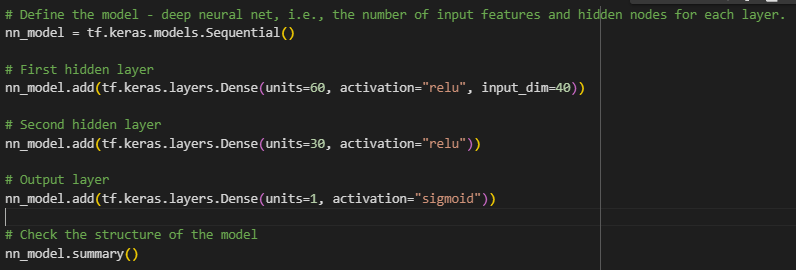

# deep-learning-challenge

## Background
The nonprofit foundation Alphabet Soup wants a tool that can help it select the applicants for funding with the best chance of success in their ventures. With my knowledge of machine learning and neural networks, I used the features in the provided dataset to create a binary classifier that can predict whether applicants will be successful if funded by Alphabet Soup with a 72% accuracy rate.

Using a CSV containing more than 34,000 organizations that have received funding from Alphabet Soup over the years, I compiled, trained, and evaluated the neural network model.

## Tools Used
- sklearn - train_test_split
- tensorflow
- pandas

### Analysis

## Overview
The purpose of this analysis is to evaluate the neural network models.

## Results

### Data Preprocessing
* Variables
    * Target: IS_SUCCESSFUL
    * Features: APPLICATION_TYPE, AFFILIATION, CLASSIFICATION, USE_CASE, ORGANIZATION, STATUS, INCOME_AMT, SPECIAL_CONSIDERATIONS, ASK_AMT
    * Dropped Variables: EIN, NAME

### Compiling, Training, and Evaluating the Model

* The model has one input layer, two hidden layers, and an output layer. 
* I aimed for a target performance of 75% but I did not achieve this target.
* I attempted to increase the performance of the model by using ReLU and Tanh activation methods, increasing and decreasing epochs, and increasing and decreasing nodes. 
* Using the Tanh activation, my model performance decreased.

